# HELIO Pro V1

*Advanced Photometric Stereo · Quantitative RTI · Archival Metrology · 3D Diagnostics*

---


---

HELIO Pro is a photometric stereo imaging application for cultural heritage documentation. Feed it a set of multi-light photographs — manuscripts, coins, seals, inscriptions, book bindings, archaeological objects — and it builds normal maps, calibrated depth maps, ISO surface metrology, and interactive 3D renders you can actually use.

Developed by Scott Maloney. Free and open source under MIT.

**[GitHub Issues](https://github.com/sjm208/Helio-Pro/issues) · [Install guide](INSTALL.md) · [Quickstart manual](HELIO_Pro_Quickstart.md)**

---

## A note on this release

This grew out of hands-on imaging work rather than a planned software project. The core pipeline — photometric stereo solving, 3D export, publication output — is solid and actively used. That said, it's shared as a research tool, not a finished product.

Some features are more mature than others. There are likely redundant or overlapping functions in the current codebase; the final version will probably be leaner with some things removed or consolidated. Metrology outputs should be verified independently before use in formal conservation or publication contexts. Bugs exist.

Feedback and issue reports are genuinely welcome.

If you use it in published research, a citation or acknowledgement is appreciated.

---

## A note on development

I come from a hobbyist background — Arduino programming in C++, with Python relatively new to me. [Claude AI](https://www.anthropic.com) (Anthropic) served as the development partner that made the transition possible. The imaging concepts, domain knowledge, and research direction are entirely my own. This is mentioned as an honest account of how the project came together, and because it might be useful to others in similar positions.

---

## What it does

### The main window

The interface is split into a left panel for capture setup and light calibration, a central viewport with interactive relighting, and a right panel for analysis, export, and metrology.

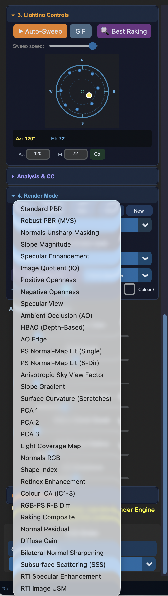

40+ render engines cover photometric and spectral analysis. Drag the dome control in the left panel to relight in real time. The A/B wipe slider lets you compare any two engines side by side.


Light calibration sits in the left panel: chrome sphere auto-detection, a 10-tool virtual dome calibrator for rigs without a sphere, direct `.lp` file import from RTIBuilder or dome controllers.

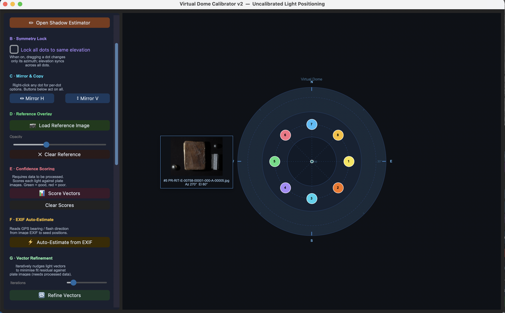

---

### 3D mesh viewer

The OpenGL viewer reconstructs a 3D mesh directly from the photometric stereo depth data. Toggle between colour texture and clay render with `C`.

| Colour mode | Clay mode |
|:-----------:|:---------:|
| 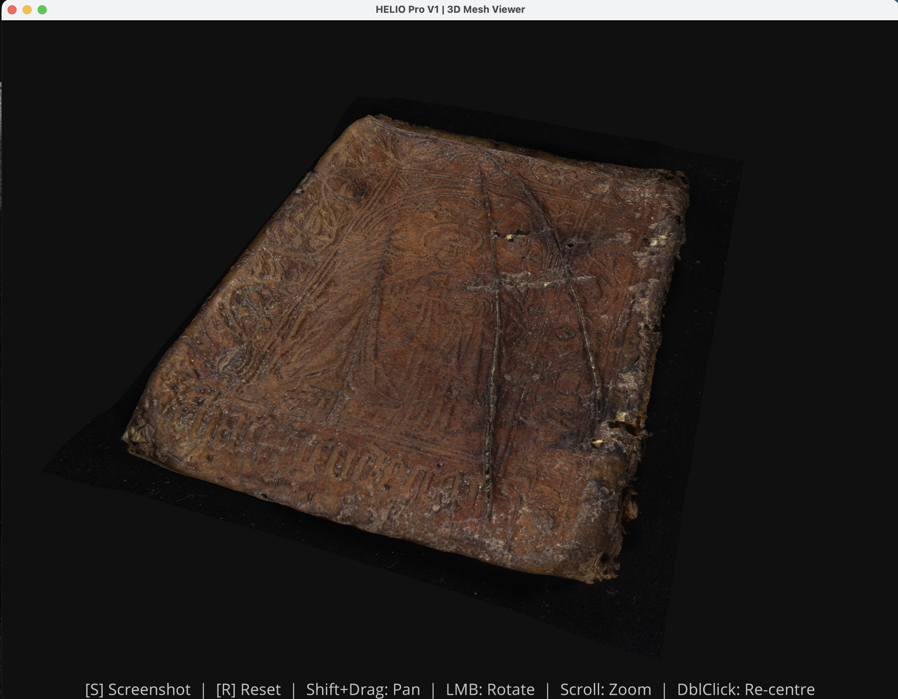 | 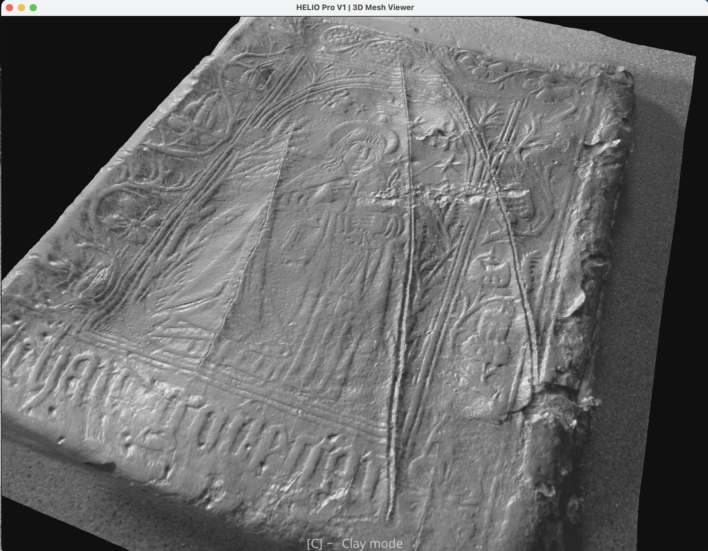 |

Export the mesh as OBJ, GLB, PLY, STL, or E57. `S` saves a clean 3200×2000 render.

---

### Right panel — export and analysis

The right panel is tabbed across 2D exports, 3D viewers and pipelines, metrology, archive, and AI tools.

**2D Renders**

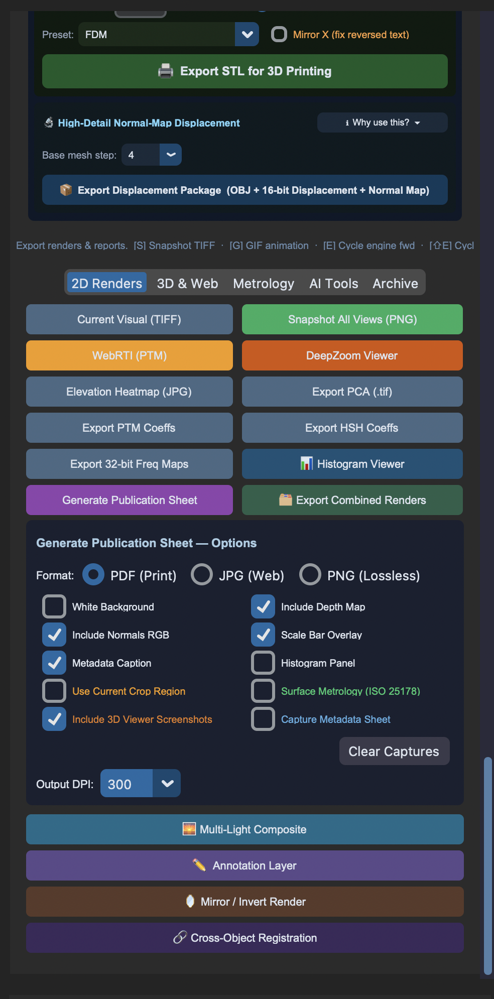


Full-resolution TIFF of the current view, snapshot of all engines at once, WebRTI browser viewer, DeepZoom gigapixel viewer, and the publication sheet builder with preset layouts for different object types.

**3D viewers and export pipeline**

| 3D viewer launch | 3D export pipeline | 3D adjustments |
|:----------------:|:------------------:|:--------------:|
| 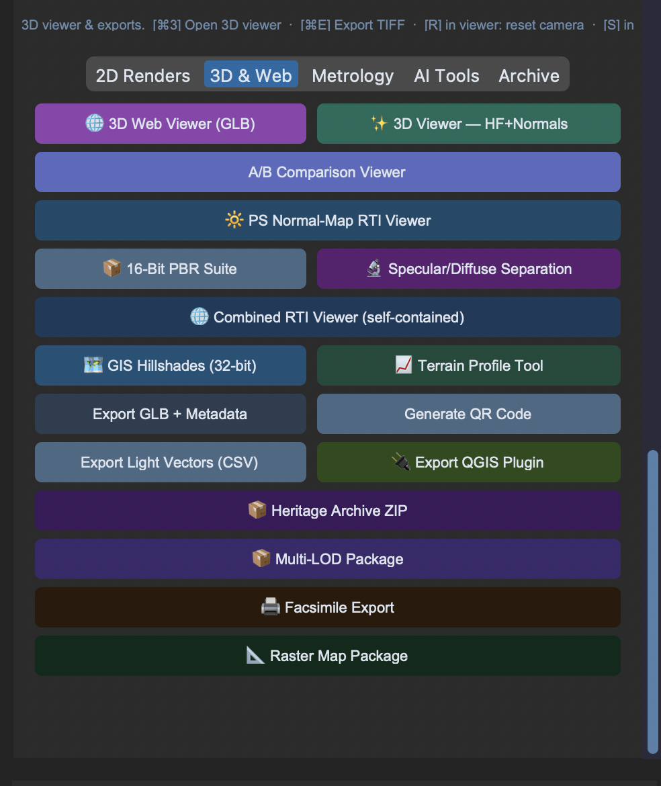 | 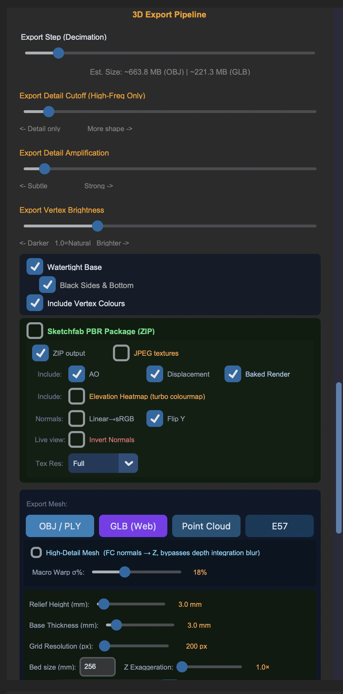 | 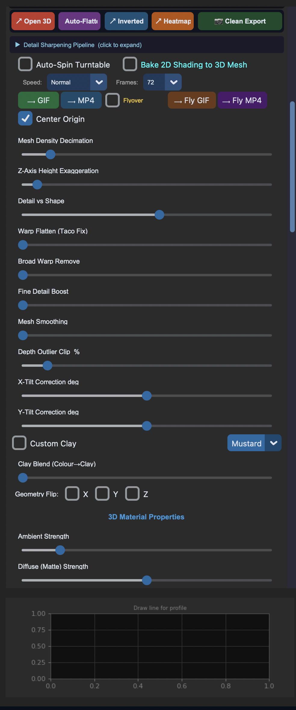 |

**Metrology**

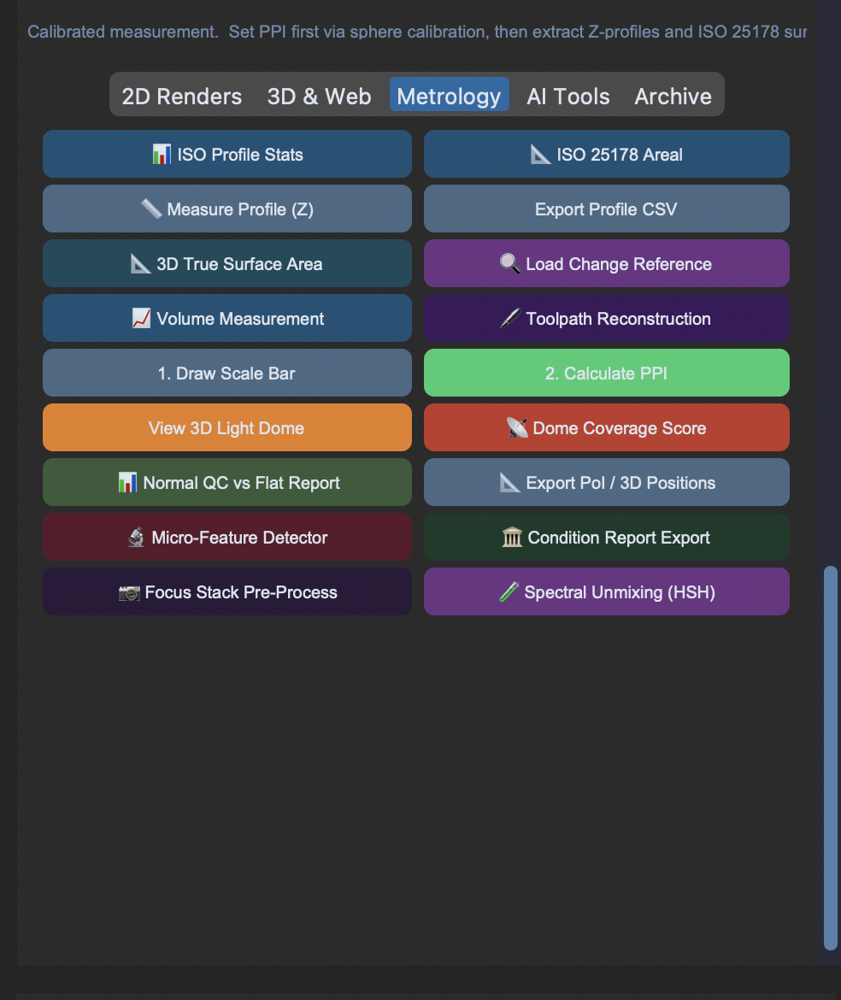

ISO 25178 areal roughness (Sa, Sq, Sz), ISO 4287 profile roughness from any drawn cross-section, physical scale calibration via scale bar and Z-reference, dome coverage scoring, and normal QC reports.

**Archive and metadata**

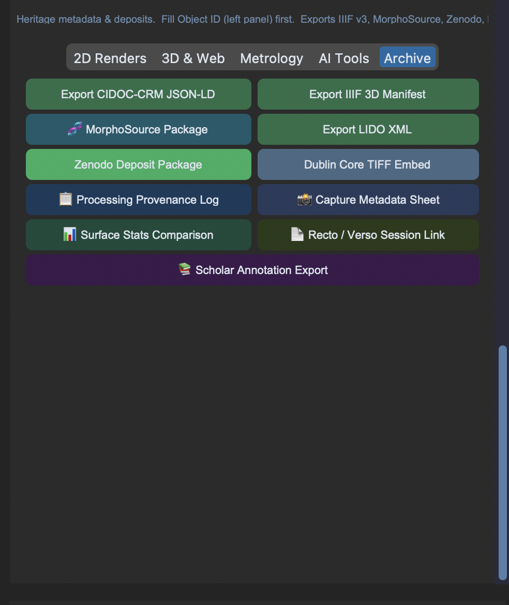

CIDOC-CRM JSON-LD, IIIF 3.0 manifest, LIDO XML, Dublin Core TIFF embed, Zenodo deposit package, MorphoSource package, Heritage Archive ZIP, and a full processing provenance log.

**AI tools**

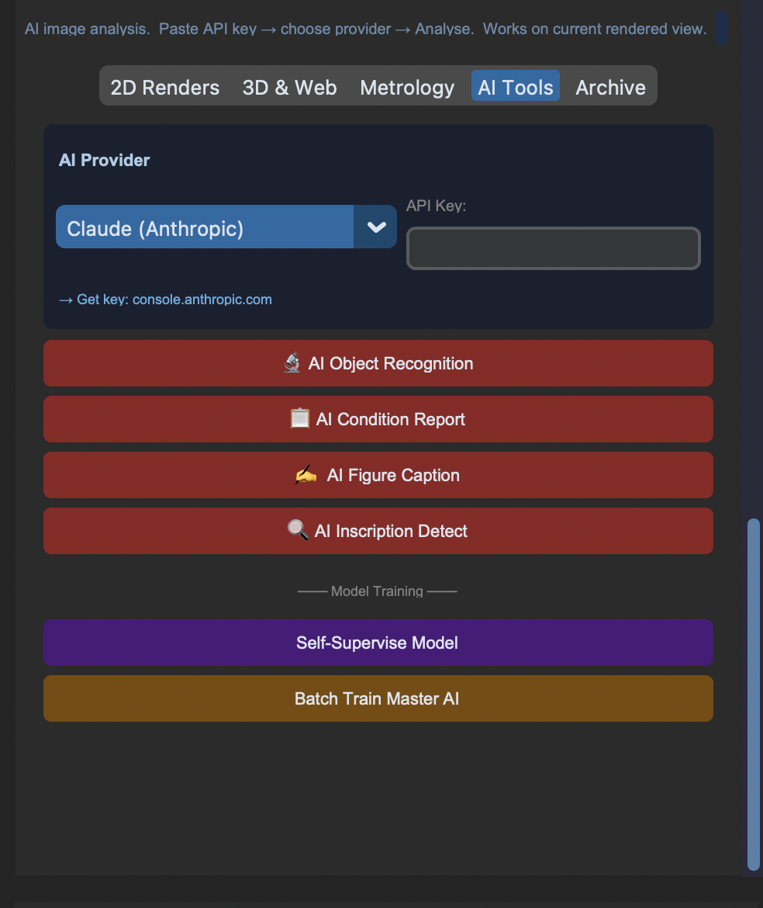

Claude API integration for surface analysis, condition reports, and figure captions. Neural PS training for recurring material types. Requires an Anthropic API key and optionally PyTorch.

---

## Capture methods

Works with any multi-light setup:

- Custom DIY spider/spoke rig — microcontrolled multi-LED matrix
- RTI dome with chrome sphere (CHI / Kulturform / custom)
- Handheld flash or torch
- `.lp` file import from RTIBuilder, Relight, or any dome controller

---

## Quick install

> New to Python? See [INSTALL.md](INSTALL.md) for a plain-language walkthrough for macOS and Windows.

```bash
git clone https://github.com/sjm208/Helio-Pro.git
cd Helio-Pro
pip install -r requirements.txt
python Helio_Pro_V1.py
```

Python 3.10, 3.11, or 3.12. Python 3.13 not yet fully supported.

Optional:
```bash
pip install torch torchvision   # Neural PS solver (~2 GB)
pip install anthropic            # AI tools (API key required)
```

---

## Documentation

[INSTALL.md](INSTALL.md) — installation for macOS and Windows, troubleshooting  
[HELIO_Pro_Quickstart.md](HELIO_Pro_Quickstart.md) — user manual, beginner through advanced  
[CAPTURE_GUIDE.md](CAPTURE_GUIDE.md) — how to photograph objects for photometric stereo  
[CHANGELOG.md](CHANGELOG.md) — version history  

---

## Disclaimer

Provided for research and experimentation. Results should be validated before use in formal conservation, publication, or archival contexts. Surface metrology is computed from photometric stereo depth data and may not match contact profilometry. No warranty — see [LICENSE](LICENSE).

Third-party algorithms used here are credited in the citations section below.

---

## Citations

HELIO Pro implements or builds on the following. Please cite the relevant works when using their outputs in research.

**Photometric stereo**  
Woodham, R.J. (1980). Photometric method for determining surface orientation from multiple images. *Optical Engineering*, 19(1), 139–144.

**Polynomial Texture Maps / RTI**  
Malzbender, T., Gelb, D., & Wolters, H. (2001). Polynomial texture maps. *SIGGRAPH 2001*, 519–528.

**Depth integration — Frankot-Chellappa**  
Frankot, R.T., & Chellappa, R. (1988). A method for enforcing integrability in shape from shading. *IEEE TPAMI*, 10(4), 439–451.

**Depth integration — Simchony DCT**  
Simchony, T., Chellappa, R., & Shao, M. (1990). Direct analytical methods for solving Poisson equations in computer vision. *IEEE TPAMI*, 12(5), 435–446.

**Specular / diffuse separation**  
Mallick, S.P. et al. (2005). Beyond Lambert: Reconstructing specular surfaces using color. *CVPR 2005*.  
Tan, P. et al. (2003). Highlight removal by illumination-constrained inpainting. *ICCV 2003*.

**Relief Visualisation Toolbox — SVF, MSRM, SLRM, openness**  
Zakšek, K., Oštir, K., & Kokalj, Ž. (2011). Sky-View Factor as a Relief Visualisation Technique. *Remote Sensing*, 3(2), 398–415.  
Kokalj, Ž., & Hesse, R. (2017). *Airborne Laser Scanning Raster Data Visualization*. ZRC SAZU.  
Yokoyama, R., Shirasawa, M., & Pike, R.J. (2002). Visualizing topography by openness. *Photogrammetric Engineering and Remote Sensing*, 68(3), 257–265.  
Hesse, R. (2010). LiDAR-derived Local Relief Models. *Archaeological Prospection*, 17(2), 67–72.  
Source: github.com/EarthObservation/RVT_py (Apache 2.0)

**PS quality and calibration**  
Laurent, L. et al. (2025). Combining geometric and photometric 3D reconstruction for cultural heritage. *Journal of Cultural Heritage*.  
Gaiani, M. et al. (2025). Heritage, 8(4).

**DStretch**  
Harman, J. (2008). Using decorrelation stretch to enhance rock art images. ARAS Annual Meeting. dstretch.com

**RTI capture standard**  
Cultural Heritage Imaging (2013). *RTI Guide to Highlight Image Capture*, v2.0. culturalheritageimaging.org

**Surface metrology**  
ISO 25178-2:2021. Geometrical product specifications — Surface texture: Areal.  
ISO 4287:1997. Geometrical product specifications — Surface texture: Profile method.

**Metadata and archiving**  
IIIF Consortium (2023). *IIIF Presentation API 3.0*. iiif.io/api/presentation/3.0/  
Doerr, M. et al. (2023). *CIDOC Conceptual Reference Model*, v7.1.2. cidoc-crm.org  
Coburn, C. et al. (2004). LIDO — Lightweight Information Describing Objects. lido-schema.org  
Dublin Core Metadata Initiative (2020). *DCMI Metadata Terms*. dublincore.org  
Linked Art Editorial Board (2023). *Linked Art API*. linked.art  
ASTM E2807-11 (2017). *Standard Specification for the E57 File Format*. ASTM International.

**MorphoSource**  
Boyer, D.M. et al. (2016). MorphoSource: Archiving and sharing 3-D digital specimen data. *Paleontological Society Papers*, 22, 157–181.

**OpenSeadragon**  
OpenSeadragon Contributors (2023). openseadragon.github.io (BSD 3-Clause)

---

## Citing this software

Maloney, S. (2025). HELIO Pro: Photometric Stereo & RTI Surface Imaging Software.  
https://github.com/sjm208/Helio-Pro

---

## License

MIT — see [LICENSE](LICENSE)
